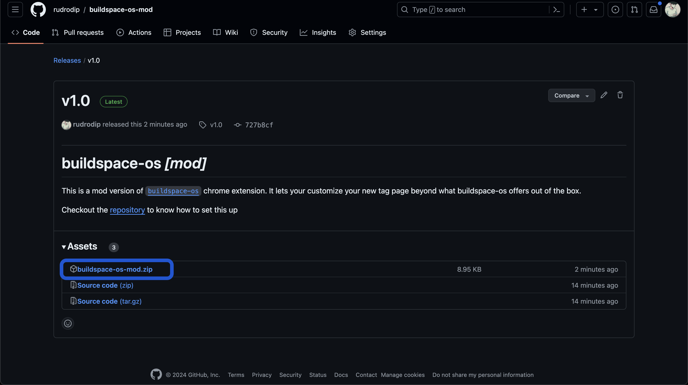
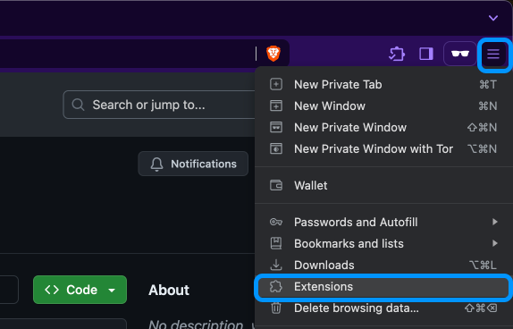
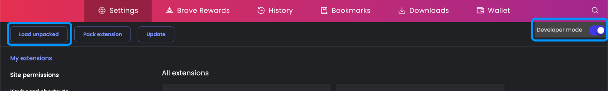
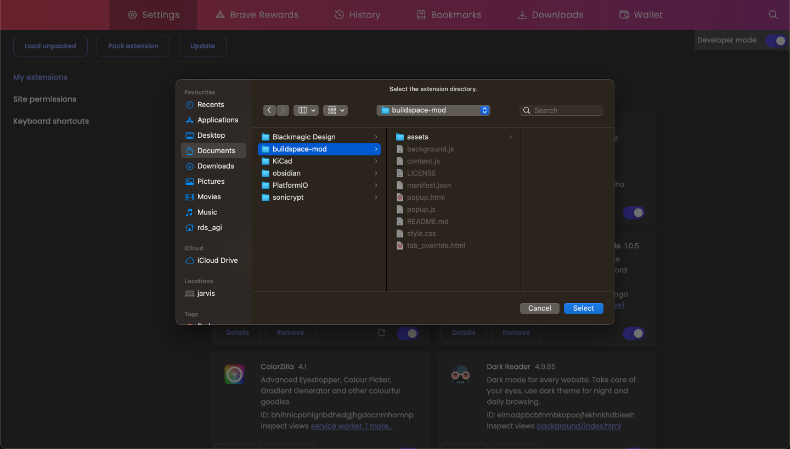
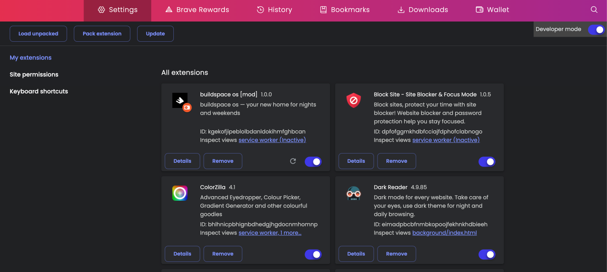
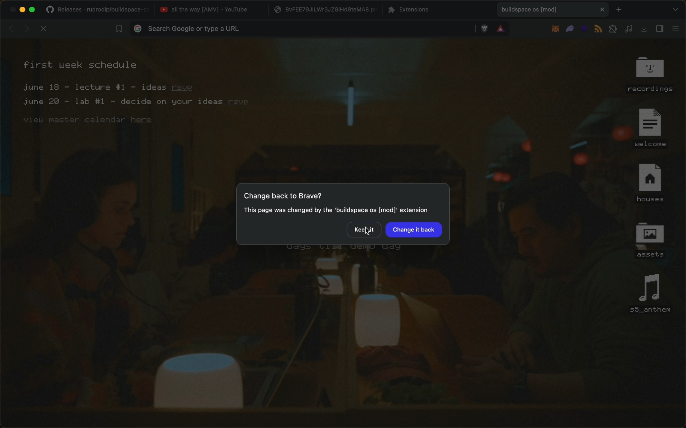
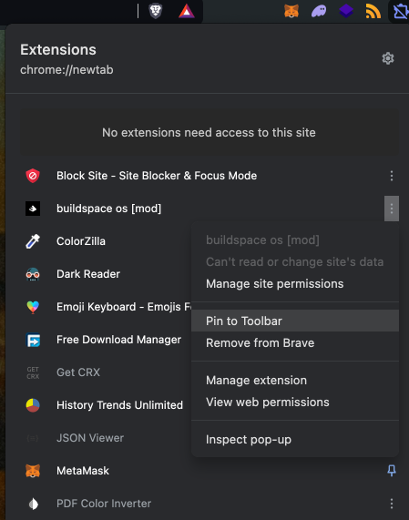
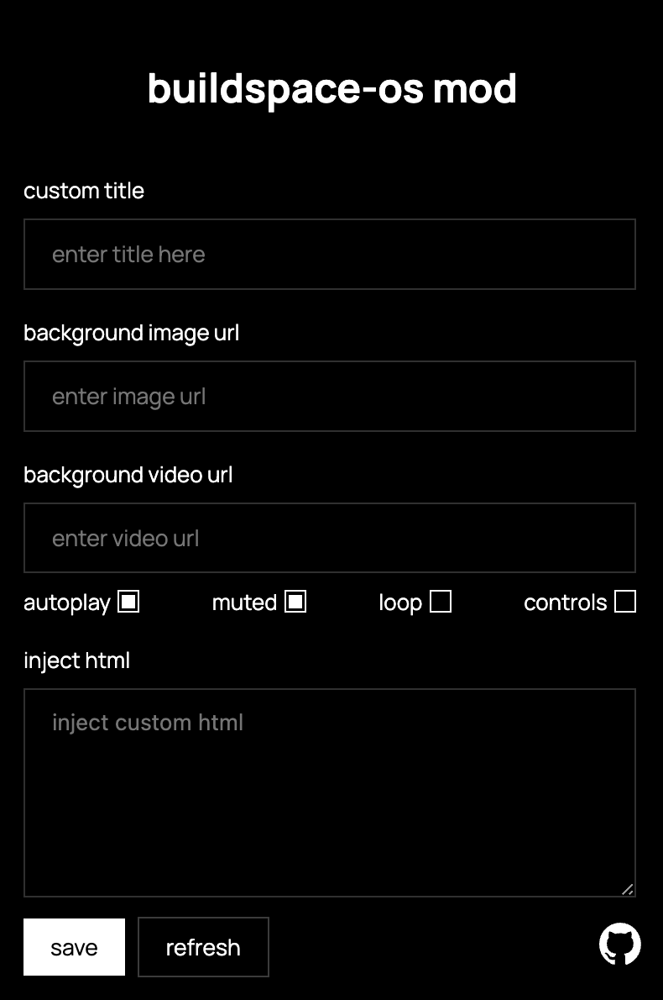

# buildspace os [mod version]

https://github.com/rudrodip/buildspace-os-mod/assets/77154365/1fd7173c-a79e-4113-bab9-2f7a10213bc5

## table of contents

- [buildspace os \[mod version\]](#buildspace-os-mod-version)
  - [table of contents](#table-of-contents)
  - [features](#features)
  - [setup](#setup)
    - [1. download](#1-download)
    - [2. turn on Developer mode](#2-turn-on-developer-mode)
    - [3. add the app to your browser](#3-add-the-app-to-your-browser)
    - [4. open a new tab](#4-open-a-new-tab)
    - [5. pin the extension](#5-pin-the-extension)
    - [6. customize](#6-customize)
  - [got questions?](#got-questions)
  
## features

- customize `buildspace os` title
- customize `buildspace os` background
- inject custom html/css into the `buildspace os` page

## setup

### 1. download

download the zip file from the [release](https://github.com/rudrodip/buildspace-os-mod/releases) page. make sure to extract the download in a safe spot!

### 2. turn on Developer mode

in your browser head to the "Extensions" section. this can be found in the settings portion of your browser! checkout the screenshot below:

once you get there you'll see "Developer mode" in the top right. make sure to toggle that **on** and then you'll see new options (we're gonna be using "Load unpacked")

### 3. add the app to your browser

you're at the home stretch! press the "Load unpacked" option and then go to the folder where you saved buildspace os. it should look something like this:

once you select it you should see this (nice you did it!)

### 4. open a new tab

now you can see this thing in action! Open a new tab and you'll notice that there is a prompt saying that the page was changed by the buildspace os extension. **Make sure to select keep it or it will not work.**

### 5. pin the extension

pin the extension so you can easily access it in the future!

### 6. customize

now you can customize the `buildspace os` page to your liking! you can change the title, background, and inject custom html/css into the page.

## got questions?

for any questions please reach out to me on x (formerly twitter) at [@rds_agi](https://x.com/rds_agi)
